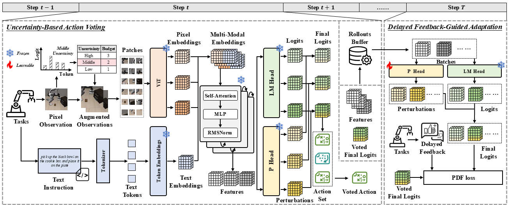

# Test-Time Perturbation Tuning with Delayed Feedback for Vision-Language-Action Models
<p align="center">
  <a href='https://arxiv.org/abs/2604.18107'></a>
  <a href="https://github.com/zhoujiahuan1991/CVPR2026-PDF"></a>
</p>

This repository contains the official implementation of the CVPR 2026 paper **Test-Time Perturbation Tuning with Delayed Feedback for Vision-Language-Action Models**.

## Framework



## Install

This code evaluates PDF on the [LIBERO](https://github.com/Lifelong-Robot-Learning/LIBERO) benchmark. We recommend installing LIBERO and this repository in the same conda environment.

```bash
conda create -n libero python=3.10 -y
conda activate libero
```

Install LIBERO:

```bash
git clone https://github.com/Lifelong-Robot-Learning/LIBERO.git
cd LIBERO
pip install -r requirements.txt
pip install -e .
cd ..
```

Install this repository from the project root:

```bash
cd <path-to-pdf-libero>
pip install -e .
```

For headless servers, install `xvfb` and use MuJoCo GL rendering:

```bash
sudo apt-get update
sudo apt-get install -y xvfb
export MUJOCO_GL=glx
```

If LIBERO is not installed as an editable package, point `LIBERO_SOURCE_DIR` to your local LIBERO checkout:

```bash
export LIBERO_SOURCE_DIR=<path-to-LIBERO>
```

The upstream LIBERO installation guide uses Python 3.8.13 and older PyTorch versions. This repository follows the dependencies in `pyproject.toml`, including PyTorch 2.2.0, so use the environment above for PDF experiments.

## Runs

The bash scripts evaluate all 10 tasks in a LIBERO suite and save per-task logs plus a `summary.tsv` file under `results/`.

```bash
# LIBERO-Spatial
CONDA_ENV=libero \
GPU_ID=0 \
bash scripts/start_spatial.sh

# LIBERO-Object
CONDA_ENV=libero \
GPU_ID=0 \
bash scripts/start_object.sh

# LIBERO-Goal
CONDA_ENV=libero \
GPU_ID=0 \
bash scripts/start_goal.sh

# LIBERO-Long
CONDA_ENV=libero \
GPU_ID=0 \
bash scripts/start_10.sh
```

The scripts default to the corresponding OpenVLA Hugging Face checkpoint names. Override `CHECKPOINT` when using a local checkpoint or a different model:

```bash
CHECKPOINT=<path-or-huggingface-model-id> bash scripts/start_spatial.sh
```

Common options can also be overridden with environment variables:

```bash
NUM_TRIALS_PER_TASK=50 \
AUGMENTATION_TIMES=2 \
PERTURB_SCALE=1.0 \
LEARNING_RATE=1e-4 \
KL_COEF=0.01 \
SAVE_VIDEOS=False \
bash scripts/start_spatial.sh
```

To evaluate a single task directly with Python:

```bash
CUDA_VISIBLE_DEVICES=0 MUJOCO_GL=glx \
xvfb-run -s "-screen 0 1280x720x24" -a \
python -m pdflibero.pdf \
  --model_family openvla \
  --pretrained_checkpoint openvla/openvla-7b-finetuned-libero-spatial \
  --task_suite_name libero_spatial \
  --task_id 0 \
  --center_crop True \
  --num_trials_per_task 50 \
  --num_steps_wait 10 \
  --augmentation_times 2 \
  --perturb_scale 1.0 \
  --learning_rate 1e-4 \
  --kl_coef 0.01 \
  --feedback_baseline 0.5 \
  --baseline_momentum 0.9 \
  --update_batch_size 64 \
  --update_epochs 1 \
  --save_videos False
```

## Results

| Method      | Pub.       | Param. | Spatial SR | Spatial Rank | Object SR | Object Rank | Goal SR | Goal Rank | Long SR | Long Rank | Avg. SR | Avg. Rank |
| ----------- | ---------- | ------ | ---------- | ------------ | --------- | ----------- | ------- | --------- | ------- | --------- | ------- | --------- |
| PackNet     | CVPR’18    | -      | 0.63       | 11           | 0.60      | 10          | 0.75    | 8         | 0.25    | 12        | 0.56    | 10.2      |
| ER          | Arxiv’19   | -      | 0.56       | 12           | 0.44      | 12          | 0.49    | 11        | 0.32    | 11        | 0.45    | 11.5      |
| SeqL        | NeurIPS’23 | -      | 0.20       | 13           | 0.26      | 13          | 0.22    | 12        | 0.15    | 13        | 0.21    | 12.8      |
| MTL         | NeurIPS’23 | -      | 0.83       | 6            | 0.54      | 11          | 0.80    | 3         | 0.48    | 9         | 0.66    | 7.2       |
| ATM         | RSS’23     | -      | 0.69       | 10           | 0.68      | 8           | 0.78    | 5         | 0.39    | 10        | 0.63    | 10.5      |
| OpenVLA     | CoRL’24    | -      | 0.79       | 8            | 0.86      | 4           | 0.85    | 2         | 0.51    | 7         | 0.75    | 5.2       |
| OpenVLA†    | CoRL’24    | -      | 0.85       | 2            | 0.64      | 9           | 0.76    | 6         | 0.53    | 6         | 0.69    | 5.8       |
| DP          | IJRR’25    | -      | 0.78       | 9            | 0.92      | 1           | 0.68    | 10        | 0.51    | 8         | 0.72    | 7         |
| OCTO        | RSS’24     | 93M    | 0.79       | 8            | 0.86      | 4           | 0.85    | 2         | 0.51    | 7         | 0.75    | 5.3       |
| TraceVLA    | ICLR’25    | 130M   | 0.85       | 4            | 0.85      | 5           | 0.75    | 7         | 0.54    | 4         | 0.75    | 6.5       |
| OpenVLA-DPO | Arxiv’25   | 130M   | 0.84       | 5            | 0.89      | 2           | 0.79    | 4         | 0.53    | 5         | 0.76    | 4         |
| SFT-4LIBERO | Arxiv’25   | 130M   | 0.85       | 3            | 0.87      | 3           | 0.77    | 5         | 0.55    | 3         | 0.76    | 3.5       |
| MG-Select   | Arxiv’25   | 130M   | 0.82       | 7            | 0.73      | 6           | 0.73    | 9         | 0.55    | 2         | 0.71    | 6         |
| PDF (Ours)  | CVPR’26    | 9M     | 0.90       | 1            | 0.72      | 7           | 0.86    | 1         | 0.59    | 1         | 0.77    | 2.5       |

## Citation

```bibtex
@misc{zang2026testtimeperturbationlearningdelayed,
      title={Test-Time Perturbation Learning with Delayed Feedback for Vision-Language-Action Models}, 
      author={Zehua Zang and Xi Wang and Fuchun Sun and Xiao Xu and Lixiang Lium and Jiahuan Zhou and Jiangmeng Li},
      year={2026},
      eprint={2604.18107},
      archivePrefix={arXiv},
      primaryClass={cs.CV},
      url={https://arxiv.org/abs/2604.18107}, 
}
```

## Acknowledgement

This codebase builds on the [OpenVLA project](https://openvla.github.io/). We thank the authors for their excellent work.

## Contact

For questions, please contact us at [zehua2020@iscas.ac.cn](mailto:zehua2020@iscas.ac.cn).

Please visit the [OV<sup>3</sup> Lab homepage](https://zhoujiahuan1991.github.io/) for more information about our papers, code, and datasets.
